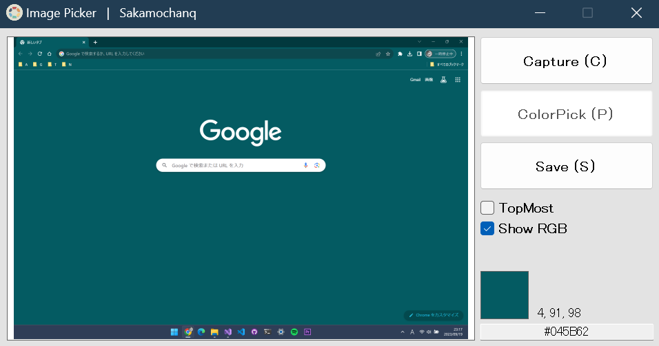

<div align="left">
  <h3>- Image Picker -</h3>
  <br>
  <a href="#">
    
  </a>
  <br>
  <br>
<!--<p>Obtaining RGB or HTML color codes from the screen.</p> -->
</div>

## Color Pick

This tool allows you to obtain the colors on the screen as RGB values or HTML color codes.  
It calculates the coordinates of a mouse click and obtains the color in pixel values.  
By clicking in the PictureBox, you can get the detailed data of the color at that coordinate.  
Since the image is a Bitmap screenshot, it can be saved in different formats using the Save button.  

<br>

```cs
Color PickedColor = Image.GetPixel(ClickPoint.X, ClickPoint.Y);
```

<br>

## Screenshot

<br>



<br>

## License

All codes are released under [MIT](https://github.com/Sakamochanq/dotnet-archive/blob/master/LICENSE) LICENSE.

Developer : [Sakamochanq](https://github.com/Sakamochanq)
