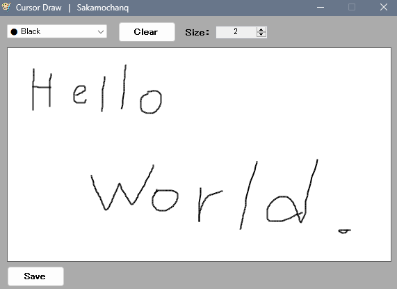

<div align="left">
  <h3>- Cursor Draw -</h3>
  <br>
  <a href="#">
    
  </a>
  <br>
  <br>

</div>

## Draw

The easiest paint tool using the default library.  
Features the ability to change pen color and pen size.  
This is just a test application and will not be updated after this.

<br>

```cs
g.DrawLine(pen, previousPoint, e.Location);
```

<br>

## Screenshot

<br>



<br>

## License

All codes are released under [The Unlicense](https://github.com/Sakamochanq/dotnet-archive/blob/master/LICENSE).

Developer : [Sakamochanq](https://github.com/Sakamochanq)
