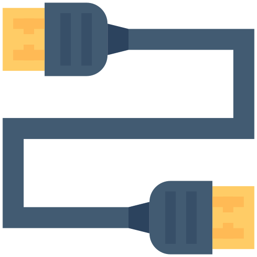
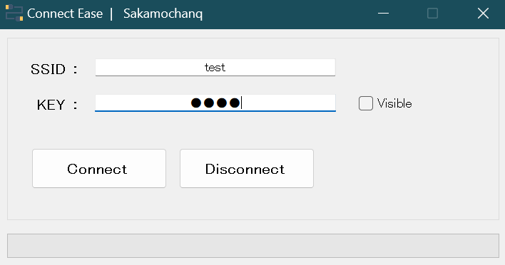

<div align="left">
  <h3>- Connect Ease -</h3>
  <br>
  <a href="#">
    
  </a>
  <br>
  <br>

</div>

## Connect

Tools to connect to the Internet from Wi-Fi SSID and KEY  
It probably doesn't work, and I'm a wimp and I don't know why.

<br>

```cs
ProcessStartInfo psi = new ProcessStartInfo("netsh", $"wlan connect ssid={SSID} keyMaterial={KEY}");
```

<br>

## Screenshot

<br>



<br>

## License

All codes are released under The [MIT](https://github.com/Sakamochanq/dotnet-archive/blob/master/LICENSE) License.

Developer : [Sakamochanq](https://github.com/Sakamochanq)