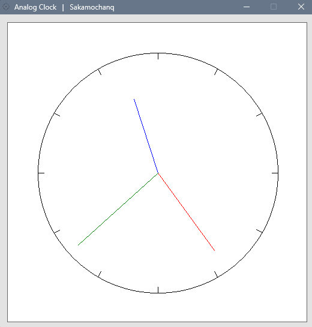

<div align="left">
  <h3>- Analog Clock -</h3>
  <br>
  <a href="#">
    
  </a>
  <br>
  <br>

</div>

## Tick

The hour hand, minute hand, and second hand are drawn in the PictureBox   
vaccording to the current time and updated every second.  

<br>

```cs
DateTime dt = DateTime.Now;
```

<br>

## Screenshot

<br>



<br>

## License

All codes are released under The [MIT](https://github.com/Sakamochanq/dotnet-archive/blob/master/LICENSE) License.

Developer : [Sakamochanq](https://github.com/Sakamochanq)
